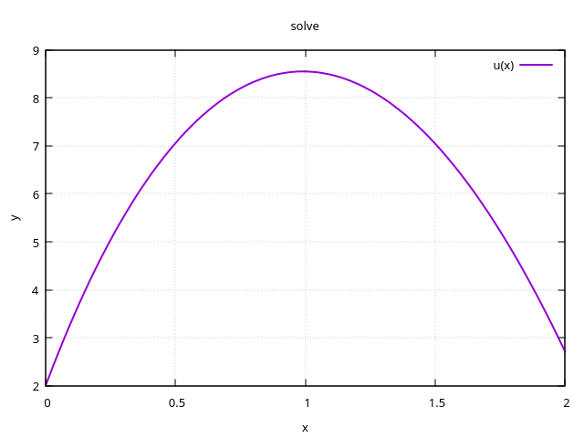
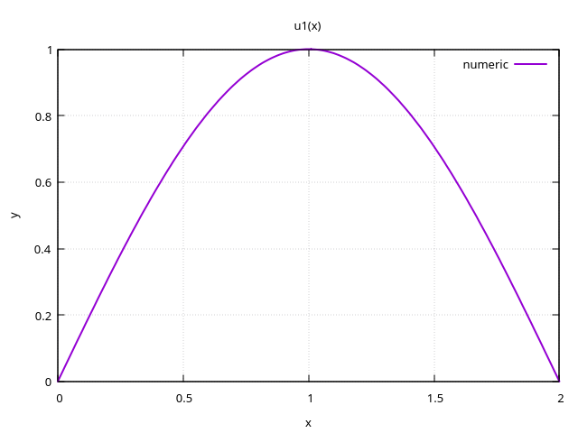

# Numerical Methods

Лабораторные работы и курсовая работа по численным методам.

## 📁 Структура 
```bash
numerical_methods/
├── lab_1/ # Лабораторная работа 1 (MATLAB)
├── lab_2/ # Лабораторная работа 2 (MATLAB)
├── practical-tasks/ # Практические задания
├── course_work/ # Курсовая работа
│ ├── report/ # Исходники и PDF отчёта
│ ├── diffcore-cpp/ # C++ библиотека (submodule)
│ ├── solve.cpp # Решение краевой задачи
│ ├── eigen-values.cpp # Задача на собственные значения
│ ├── model.cpp # Модельная задача
│ └── example.nb # Пример в Wolfram Mathematica
└── README.md
```

## 🎓 Курсовая работа

**Тема:** «Решение краевой задачи и задачи на собственные значения для обыкновенного дифференциального уравнения второго порядка»

Используется интегро-интерполяционный метод второго порядка на равномерной сетке.  
Программная реализация — на C++ с применением библиотеки **diffcore-cpp** и **Eigen**.

### Основные результаты

- Построена разностная схема второго порядка для ДСК
- Подтверждена точность на тестах с нулевой и ненулевой погрешностью
- Исследована зависимость погрешности от шага сетки и числа обусловленности
- Решена задача Штурма–Лиувилля для своего варианта (D1)

### Графики

| Решение краевой задачи | Собственная функция |
|:---:|:---:|
|  |  |

### Запуск

```bash
cd course_work
# Краевая задача
g++ -O3 -march=native -ffast-math solve.cpp diffcore-cpp/src/conditions.cpp \
    -I diffcore-cpp/include -I /usr/include/eigen3 -std=c++20 -o solve
./solve

# Задача на собственные значения
g++ -O3 -march=native -ffast-math eigen-values.cpp diffcore-cpp/src/conditions.cpp \
    -I diffcore-cpp/include -I /usr/include/eigen3 -std=c++20 -o eigen
./eigen
```

## 📄 Лицензия

MIT (см. файл LICENSE).
## 👤 Автор

bequ1n
